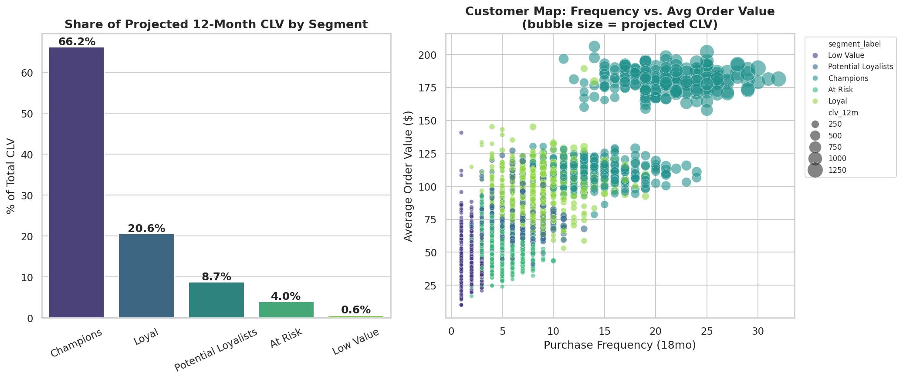

# Customer Segmentation & Lifetime Value (CLV)

**Business question:** Which customers actually drive revenue, and where should retention/acquisition budget go?

## Approach
1. Generate an 18-month e-commerce transaction log with realistic customer archetypes (champions, loyal, at-risk, new, low-value).
2. Compute RFM features (Recency, Frequency, Monetary) per customer.
3. Segment customers with K-Means clustering (log-transformed, standardized features) — segments are labeled by business meaning derived from cluster centroids, not hardcoded.
4. Project 12-month CLV per customer using a transparent, explainable heuristic: expected order volume × average order value × gross margin, discounted by a recency-based churn adjustment. (A production version would swap this for a full BG/NBD or Pareto/NBD model — the point here is a result a non-technical stakeholder can audit line by line.)

## Result



**Champions (19.6% of customers) generate 66.2% of projected 12-month CLV.** At-risk and low-value segments (40.6% of customers) generate under 5% combined.

**Recommendation:** Reallocate retention spend toward Champions and Potential Loyalists, and build a lookalike acquisition model from the Champions' RFM profile rather than spreading acquisition budget evenly.

## Run it
```bash
python segmentation_clv.py
```
Outputs: `outputs/segmentation_clv_overview.png`, `outputs/segment_summary.csv`, `data/customer_rfm_segments.csv`
