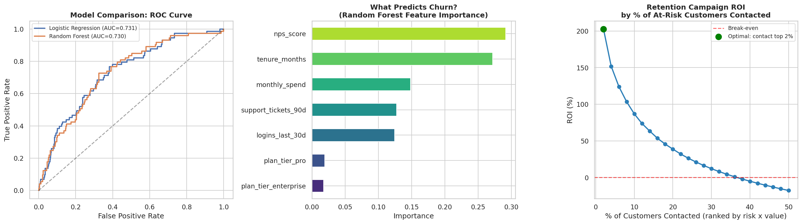

# Churn Prediction & Retention Campaign ROI

**Business question:** Which customers are about to churn — and is it actually profitable to try to save them?

## Approach
1. Generate a subscription dataset (4,000 customers) with churn driven by a realistic causal structure: tenure, login activity, support tickets, plan tier, NPS.
2. Train and compare Logistic Regression vs. Random Forest, evaluated on held-out data by AUC (not accuracy, since churn is a rare-event problem).
3. Rank customers by **churn risk × customer value**, not risk alone — a high-risk, low-value customer isn't worth contacting.
4. Simulate a retention campaign across different outreach sizes and compute ROI = (expected revenue saved − campaign cost) / campaign cost, to find the point where further outreach stops paying for itself.

## Result



Best model (Logistic Regression) achieves **AUC ≈ 0.73** on held-out data. NPS score and tenure are the strongest churn predictors. The ROI simulation shows outreach is highly profitable for the top 2% highest-risk-×-value customers (**~200%+ ROI**) but turns negative past roughly the top third of at-risk customers — proving that "contact everyone at risk" is a worse strategy than a targeted one.

**Recommendation:** Deploy the model to score customers weekly; route only the top-ranked segment to the retention team, not the full at-risk list.

## Run it
```bash
python churn_retention_roi.py
```
Outputs: `outputs/churn_model_and_roi.png`, `outputs/retention_roi_curve.csv`
