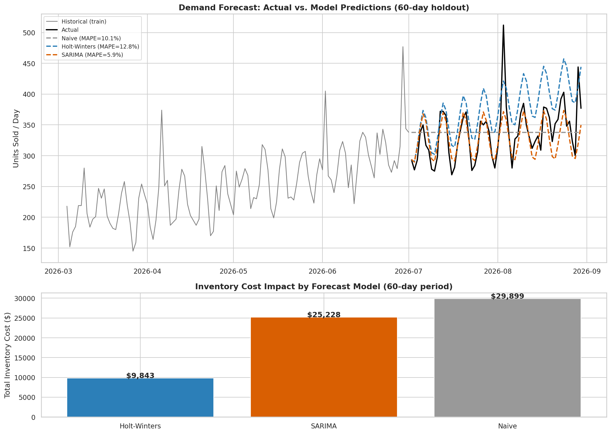

# Sales / Demand Forecasting with Inventory Cost Impact

**Business question:** How much inventory should we hold, and what does a better forecast actually save us?

## Approach
1. Generate 3 years of daily sales data with trend, weekly seasonality, yearly seasonality, and promo spikes.
2. Forecast a 60-day holdout period with three models: Naive (last-value baseline), Holt-Winters Exponential Smoothing, and SARIMA.
3. Instead of stopping at accuracy (MAPE), translate each model's forecast errors into **real inventory cost** using a newsvendor-style model: over-forecasting incurs holding cost, under-forecasting incurs a stockout penalty (lost margin) — and the two are not symmetric in most retail businesses.

## Result



SARIMA has the *lowest* MAPE (5.9%) but the *highest* total inventory cost, because its errors are systematically biased toward under-forecasting — which is expensive under a stockout-penalty-heavy cost structure. **Holt-Winters, with a higher MAPE (12.8%), produces the lowest total cost** because its errors are more balanced between over- and under-forecasting.

**Key insight for stakeholders:** the model with the best accuracy score is not automatically the right model to deploy — it depends on your cost asymmetry. Switching from the naive baseline to Holt-Winters saves an estimated **$122K/year** in inventory cost at this order volume.

## Run it
```bash
python demand_forecasting.py
```
Outputs: `outputs/forecast_and_cost_impact.png`, `outputs/model_cost_comparison.csv`
