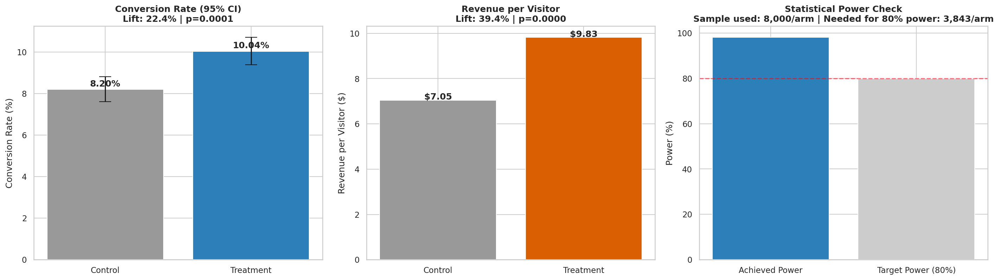

# A/B Testing Framework: From Significance to Business Decision

**Business question:** We ran a checkout/pricing experiment. Is the lift real, and what's it worth at scale?

## Approach
1. Simulate a realistic A/B test (16,000 visitors) on **two metrics**: conversion rate and revenue-per-visitor — because a conversion-rate win can hide a revenue loss (e.g. converting more low-value customers) or vice versa.
2. Run a two-proportion z-test on conversion rate (with Wilson confidence intervals) and Welch's t-test on revenue per visitor.
3. Run a power analysis to check whether the test was adequately sampled — not just whether it hit p < 0.05.
4. Translate the winning metric into a projected **annualized revenue impact** if rolled out to full traffic.

## Result



Conversion rate lift: **+22.4%** (p < 0.0001). Revenue-per-visitor lift: **+39.4%** (p < 0.0001) — the revenue lift is even larger than the conversion lift, meaning the treatment also improved order value, not just conversion count. The test was over-powered (98% achieved power vs. 80% target), confirming the result is trustworthy, not a fluke of a small sample.

**Recommendation: Ship it.** Projected annualized revenue impact at 2M visitors/year: **+$5.56M**.

## Run it
```bash
python ab_test_analysis.py
```
Outputs: `outputs/ab_test_results.png`
